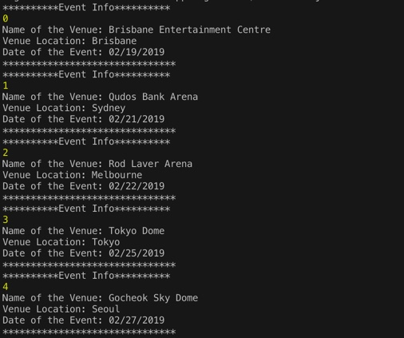
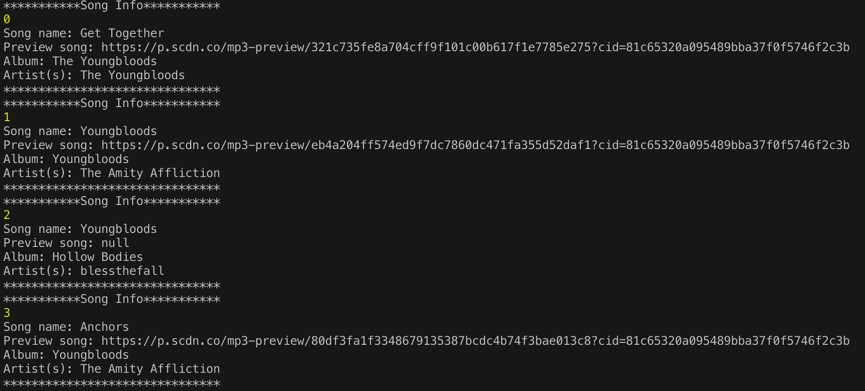
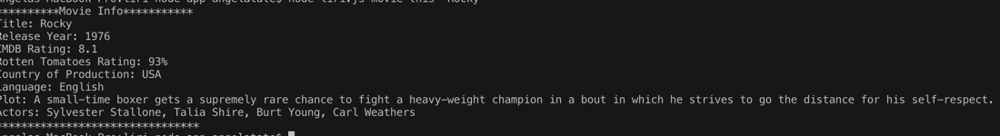
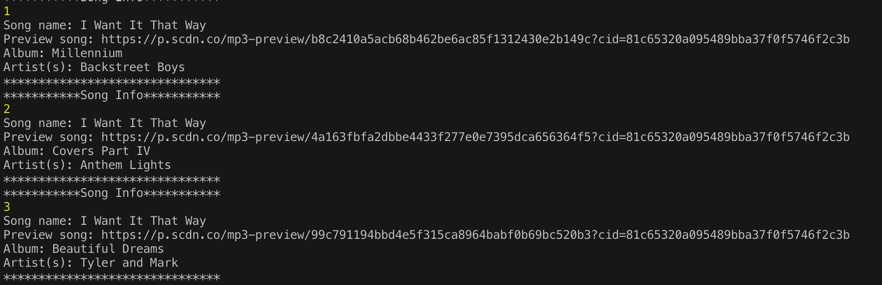

# LIRI-node-app

## Table of contents

* [About this project](#about-this-project)
* [How to use LIRI](#how-to-use-LIRI)
* [Technologies Used](#technologies)

##  About this project

LIRI is a Language Interpretation and Recognition Interface. LIRI takes in parameters to retrieve data from Twitter, Spotify, OMDB APIs and display in the command line using node.js.

##  How to use LIRI

### Step by Step instructions
1. Open your terminal.

2. Navigate to the folder that contains the liri.js file.

3. Depending on the command you run, the output will vary.

    * Example 1: Run the concert-this command
        <ul>node liri.js concert-this <name of artist or band></ul>
        <ul>Output: The system will display a list of all events and locations where the artist or band will perform. It can result in multiple records.</ul>
        <ul>See screen-shot below:</ul>
        

    * Example 2: Run the spotify-this-song command
        <ul>node liri.js spotify-this-song <name of song></ul>
        <ul>Output: The system will display a list of information associated with the song. It can result in multiple records.</ul> <ul>See screen-shot below:</ul>
        

    * Example 3: Run the movie-this command
        <ul>node liri.js movie-this <name of movie></ul>
        <ul>Output: The system will display information associated with the movie.</ul>
        <ul>See screen-shot below:</ul>
        

    * Example 4: Run the do-what-it-says command
        <ul>node liri.js do-what-it-says</ul>
        <ul>Output: The system will read the text in the random.txt file, and perform the comman listed in the random.txt file.</ul>
        <ul>See screen-shot below:</ul>
        

##  Technologies Used
* Javascript
* Nodejs
* Node packages:
    * Node-Spotify-API
    * Request
    * Moment
    * DotEnv
* APIs used:
    * Bands in Town
    * OMDB
    * GitHub